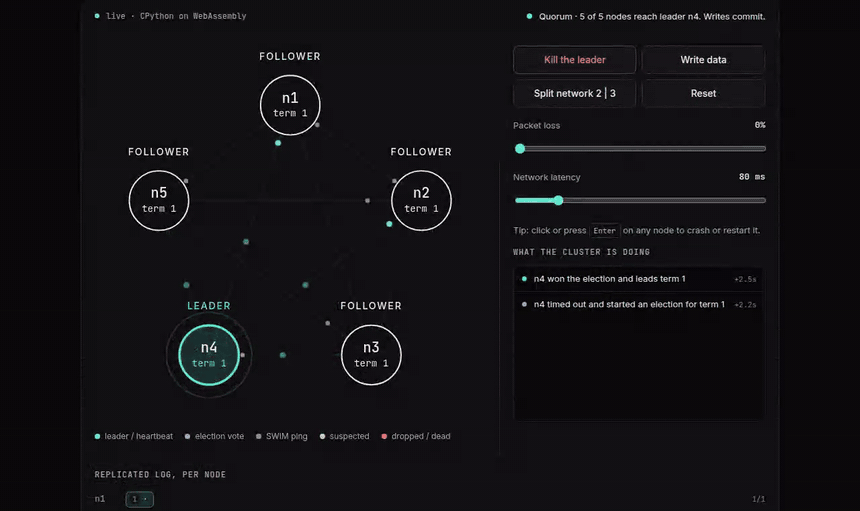
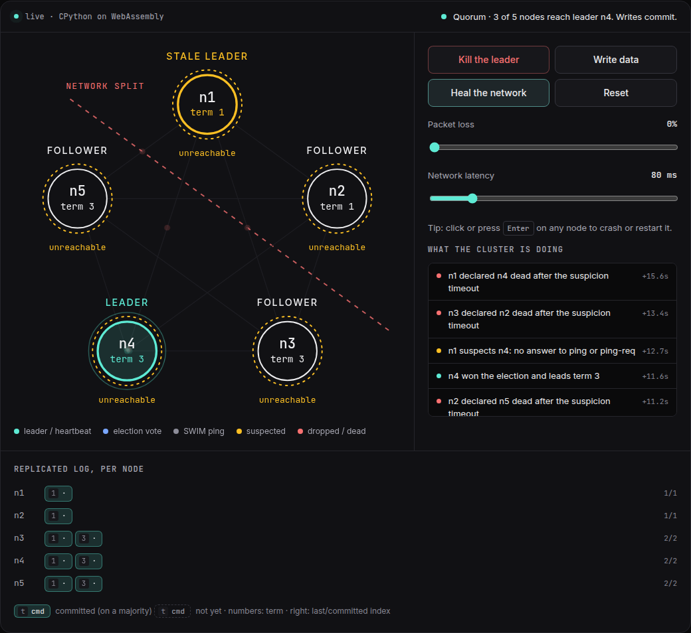
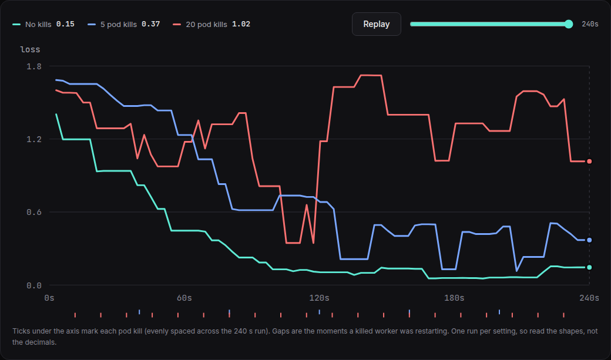
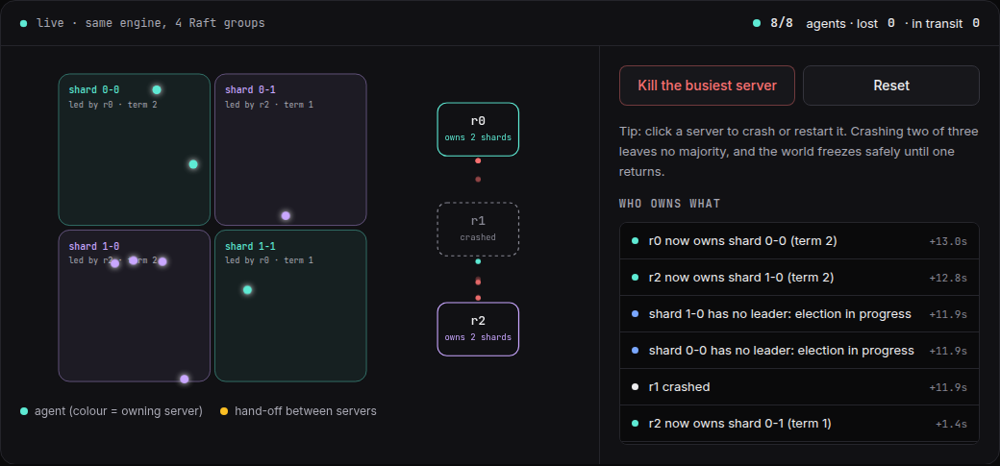

# Anchor

Spot GPUs get killed mid-run. Anchor notices the dead worker and keeps the rest training, instead of restarting from a checkpoint.

Built from scratch in Python: SWIM failure detection, Raft consensus, and fault-tolerant DiLoCo training.

**[Try it live](https://rkothari3.github.io/Anchor/)**: the real code runs in your browser. Crash nodes, split the network, drop packets.



## What it does

**Failure detection and consensus.** SWIM spots dead nodes. Raft elects one leader and keeps a replicated log. Cut the network in two and only the majority side keeps working.



**Training that survives kills.** 5 workers trained a small model on Kubernetes while pods were deleted. Training never restarted. More kills slow it down: final loss was 0.15 with no kills, 0.37 with 5, and 1.02 with 20.



**A sharded world that loses nothing.** Four regions, each its own Raft group, owned by three servers. Kill a server and ownership moves while the lost-agent counter stays at zero.



## Limits

- The Raft log is in memory. If every node restarts, state is lost.
- It is Python. It shows correctness, not speed, and it is not a replacement for etcd or Kafka.
- gRPC runs without TLS or auth.
- The training result is one run per setting on a tiny CPU model, with pod deletions standing in for real spot preemptions.

## Run it

```bash
pip install -e ".[dev]" && pytest   # 52 tests
cd site && npm ci && npm run dev    # the website
```

Code is in `src/dssd/` (`swim.py`, `raft.py`, `diloco/`, `sharding/`).
